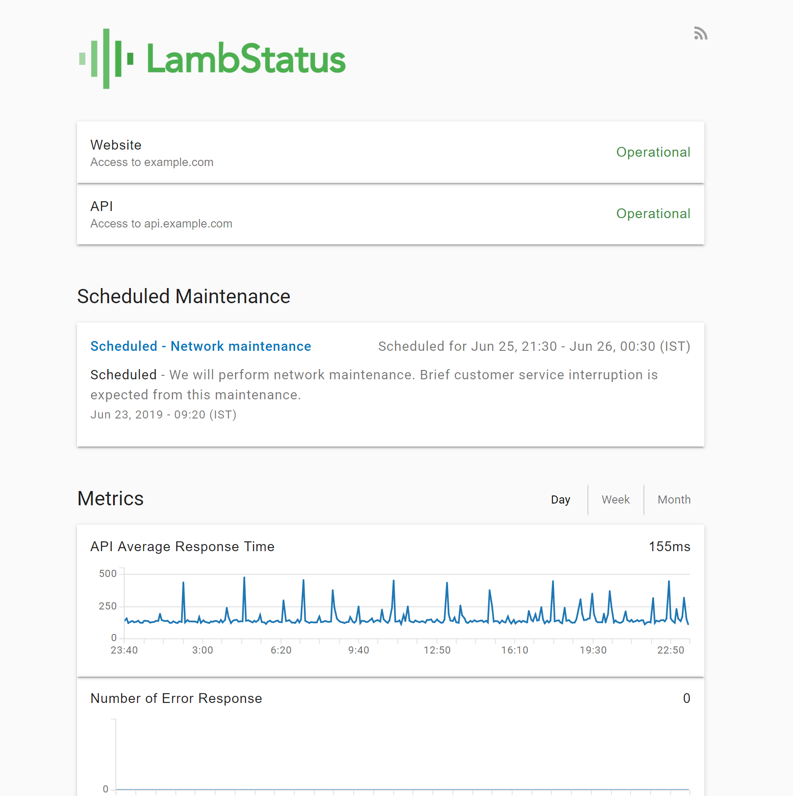
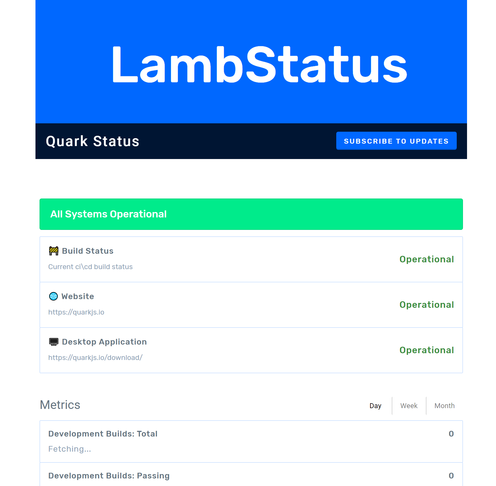

# Lambstatus theme updater
Update theme for status pages created with [lamb-status](https://github.com/ks888/LambStatus)

Lambstatus is great for creating status pages, but there's one possible area where it falls short in performance. And that is style of the generated status page.

Use this project to update the stylesheet (css) of your status pages. Here's a demo below.

<!--  -->
<div style="display:flex;">
<!-- <div> -->

<!--  -->

</div>


#### To update , follow the steps below:

1. `git clone https://github.com/Nishkalkashyap/lambstatus-theme-updater`
2. run `npm install`
3. Add a `.env` file at the root of the project like so.
   ```
    access_key=fnsbdfsbdfksdkfsfblablabla....
    secret_key=fkdsfnsdnfblablabla...
    bucket=fkdsfnsdnfblablabla...
   ```

4. run `npm run download`
5. run `npm run prepare`
6. run `npm run watch`
7. open web browser at `localhost:8080`
8. Add your styles in the file `/css/index.scss`
9. Finally, to upload your styles, run `npm run upload`
10. Dance!!! 💃 Your page styles have been updated.